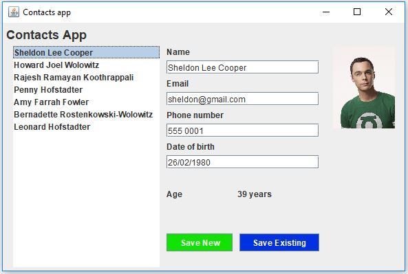

# python-gui-contacts-app

Demo app using TKinter to make a contacts app

This is my Python Tkinter equivilant of a contacts app project that I use as a Java Swing tutorial [https://pbaumgarten.com/java/swing.html](https://pbaumgarten.com/java/swing.html)

The goal is for a final product that looks like this...

